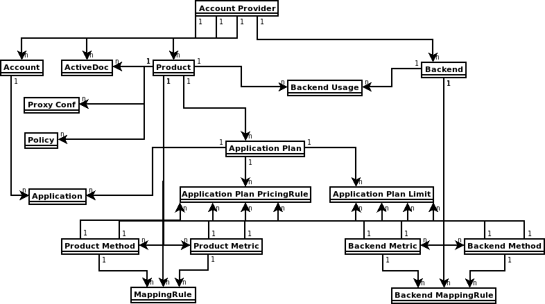
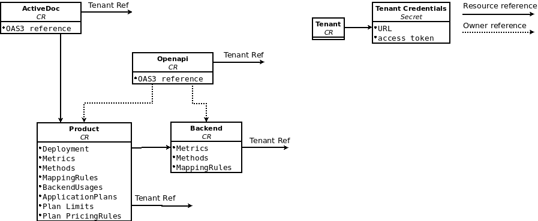

# Application Capabilities via 3scale Operator

Featured capabilities:

* Allow interaction with the underlying 3scale API Management solution.
* Manage the 3scale application declaratively using openshift (custom) resources.

The following diagram shows 3scale entities and relations that will be eligible for management using openshift (custom) resources in  a declarative way.



The following diagram shows available custom resource definitions and their relations provided by the 3scale operator.



## CRD Index

* [Backend CRD reference](backend-reference.md)
* [Product CRD reference](product-reference.md)
* [Tenant CRD reference](tenant-reference.md)

## Table of contents

* [Quickstart Guide](#quickstart-guide)
* [Backend custom resource](#backend-custom-resource)
   * [Backend metrics](#backend-metrics)
   * [Backend methods](#backend-methods)
   * [Backend mapping rules](#backend-mapping-rules)
   * [Backend custom resource status field](#backend-custom-resource-status-field)
   * [Link your 3scale backend to your 3scale tenant or provider account](#link-your-3scale-backend-to-your-3scale-tenant-or-provider-account)
* [Product custom resource](#product-custom-resource)
   * [Product Deployment Config: Apicast Hosted](#product-deployment-config-apicast-hosted)
   * [Product Deployment Config:Apicast Self Managed](#product-deployment-configapicast-self-managed)
   * [Product metrics](#product-metrics)
   * [Product methods](#product-methods)
   * [Product mapping rules](#product-mapping-rules)
   * [Product application plans](#product-application-plans)
   * [Product application plan limits](#product-application-plan-limits)
   * [Product application plan pricing rules](#product-application-plan-pricing-rules)
   * [Product backend usages](#product-backend-usages)
   * [Link your 3scale product to your 3scale tenant or provider account](#link-your-3scale-product-to-your-3scale-tenant-or-provider-account)
* [Tenant custom resource](#tenant-custom-resource)
   * [Preparation before deploying the new tenant](#preparation-before-deploying-the-new-tenant)
   * [Deploy the new tenant custom resource](#deploy-the-new-tenant-custom-resource)

## Quickstart Guide

To get up and running quickly, this quickstart guide will show how to deploy your first 3scale product and backend with the minimum requried configuration.

Requirements

* Access to an OpenShift Container Platform 4.2 cluster.
* 3scale operator up and running. [Installing through the OLM is quick and easy](quickstart-guide.md).
* Access to 3scale admin portal. Local in the working openshift namespace or remote 3scale. All you need is *3scale Admin URL* and *access token*.

**Steps**

**A)** Create `threescale-provider-account` secret with 3scale admin portal credentials. For example: `adminURL=https://3scale-admin.example.com` and `token=123456`.
```
oc create secret generic threescale-provider-account --from-literal=adminURL=https://3scale-admin.example.com --from-literal=token=123456
```

**B)** Setup 3scale backend with upstream api `https://api.example.com`.

Create yaml file with the following content:

```
apiVersion: capabilities.3scale.net/v1beta1
kind: Backend
metadata:
  name: backend1
spec:
  name: "Operated Backend 1"
  systemName: "backend1"
  privateBaseURL: "https://api.example.com"
```

Check on the fields of **Backend** custom resource and possible values in the [Backend CRD Reference](backend-reference.md) documentation.

Create custom resource:

```
oc create -f backend1.yaml
```

**C)** Setup 3scale product with all default settings using previously created backend

```
apiVersion: capabilities.3scale.net/v1beta1
kind: Product
metadata:
  name: product1
spec:
  name: "OperatedProduct 1"
  systemName: "operatedproduct1"
  backendUsages:
    backend1:
      path: /
```

Check on the fields of **Product** custom resource and possible values in the [Product CRD Reference](product-reference.md) documentation.

Create custom resource:

```
oc create -f product1.yaml
```

Created custom resources will take few seconds to setup your 3scale instance. You can check when resources are synchronized checking object's `status` field conditions.
Or directly using `oc wait` command:

```
oc wait --for=condition=Synced --timeout=-1s backend/backend1
oc wait --for=condition=Synced --timeout=-1s product/product1
```

## Backend custom resource

It is assumed the reader is familiarized with [3scale backends](https://access.redhat.com/documentation/en-us/red_hat_3scale_api_management/2.8/html/glossary/threescale_glossary#api-backend).

The minimum configuration required to deploy and manage one 3scale backend is the *Private Base URL* and a name.

```
apiVersion: capabilities.3scale.net/v1beta1
kind: Backend
metadata:
  name: backend-1
spec:
  name: "My Backend Name"
  privateBaseURL: "https://api.example.com"
```

### Backend metrics

Define desired backend metrics in your backend custom resource.

```
apiVersion: capabilities.3scale.net/v1beta1
kind: Backend
metadata:
  name: backend-1
spec:
  name: "My Backend Name"
  privateBaseURL: "https://api.example.com"
  metrics:
    metric01:
      friendlyName: Metric01
      unit: "1"
    metric02:
      friendlyName: Metric02
      unit: "1"
    hits:
      description: Number of API hits
      friendlyName: Hits
      unit: "hit"
```

Check on the fields of **Backend** custom resource and possible values in the [Backend CRD Reference](backend-reference.md) documentation.

* **NOTE 1**: `metrics` map key names will be used as `system_name`. In the example: `metric01`, `metric02` and `hits`.
* **NOTE 2**: `metrics` map key names must be unique among all metrics **AND** methods.
* **NOTE 3**: `unit` and `friendlyName` fields are required.
* **NOTE 4**: `hits` metric will be created by the operator for you if not present.

### Backend methods

Define desired backend methods in your backend custom resource.

```
apiVersion: capabilities.3scale.net/v1beta1
kind: Backend
metadata:
  name: backend-1
spec:
  name: "My Backend Name"
  privateBaseURL: "https://api.example.com"
  methods:
    method01:
      friendlyName: Method01
    method02:
      friendlyName: Method02
```

Check on the fields of **Backend** custom resource and possible values in the [Backend CRD Reference](backend-reference.md) documentation.

* **NOTE 1**: `methods` map key names will be used as `system_name`. In the example: `method01` and `method02`.
* **NOTE 2**: `methods` map key names must be unique among all metrics **AND** methods.
* **NOTE 3**: `friendlyName` field is required.

### Backend mapping rules

```
apiVersion: capabilities.3scale.net/v1beta1
kind: Backend
metadata:
  name: backend-1
spec:
  name: "My Backend Name"
  privateBaseURL: "https://api.example.com"
  mappingRules:
    - httpMethod: GET
      pattern: "/pets"
      increment: 1
      metricMethodRef: hits
    - httpMethod: GET
      pattern: "/pets/id"
      increment: 1
      metricMethodRef: hits
  metrics:
    hits:
      description: Number of API hits
      friendlyName: Hits
      unit: "hit"
```

Check on the fields of **Backend** custom resource and possible values in the [Backend CRD Reference](backend-reference.md) documentation.

* **NOTE 1**: `httpMethod`, `pattern`, `increment` and `metricMethodRef` fields are required.
* **NOTE 2**: `metricMethodRef` holds a reference to existing metric or method map key name `system_name`. In the example, `hits`.

### Backend custom resource status field

Status field shows resource information useful for the end user.
It is not regarded to be updated manually and it is being reconcilliated on every change of the resource.

Fields:

* **backendId**: 3scale bakend internal ID
* **conditions**: status.Conditions k8s common pattern. States:
  * *InSync*: Sync process going on
  * *Synced*: Sync'ed
  * *Invalid*: Invalid object. Spec should be changed.
* **observedGeneration**: helper field to see if status info is up to date with latest resource spec.

Example of *Synced* resource.

```
status:
    backendId: 59978
    conditions:
    - lastTransitionTime: "2020-06-22T10:50:33Z"
      status: "False"
      type: Failed
    - lastTransitionTime: "2020-06-22T10:50:33Z"
      status: "False"
      type: Invalid
    - lastTransitionTime: "2020-06-22T10:50:33Z"
      status: "True"
      type: Synced
    observedGeneration: 2
```

### Link your 3scale backend to your 3scale tenant or provider account

When some 3scale resource is found by the 3scale operator,
*LookupProviderAccount* process is started to figure out the tenant owning the resource.

The process will check the following tenant credential sources. If none is found, error is raised.

* Read credentials from *providerAccountRef* resource attribute. This is a secret local reference, for instance `mytenant`

```
apiVersion: capabilities.3scale.net/v1beta1
kind: Backend
metadata:
  name: backend-1
spec:
  name: "My Backend Name"
  privateBaseURL: "https://api.example.com"
  providerAccountRef:
    name: mytenant
```

The `mytenant` secret must have`adminURL` and `token` fields with tenant credentials. For example:

```
apiVersion: v1
kind: Secret
metadata:
  name: mytenant
type: Opaque
stringData:
  adminURL: https://my3scale-admin.example.com:443
  token: "XXXXXXXXXXXXXXXXXXXXXXXXXXXXXXXXXXXXXXXXXXX"
```

* Default `threescale-provider-account` secret

For example: `adminURL=https://3scale-admin.example.com` and `token=123456`.

```
oc create secret generic threescale-provider-account --from-literal=adminURL=https://3scale-admin.example.com --from-literal=token=123456
```

* Default provider account in the same namespace 3scale deployment

The operator will gather required credentials automatically for the default 3scale tenant (provider account) if 3scale installation is found in the same namespace as the custom resource.

## Product custom resource

It is assumed the reader is familiarized with [3scale products](https://access.redhat.com/documentation/en-us/red_hat_3scale_api_management/2.8/html/glossary/threescale_glossary#product).

The minimum configuration required to deploy and manage one 3scale product is the name.

```
apiVersion: capabilities.3scale.net/v1beta1
kind: Product
metadata:
  name: product1
spec:
  name: "OperatedProduct 1"
```

### Product Deployment Config: Apicast Hosted

Configure your product with *Apicast Hosted* deployment mode

```
apiVersion: capabilities.3scale.net/v1beta1
kind: Product
metadata:
  name: product1
spec:
  name: "OperatedProduct 1"
  deployment:
    apicastHosted: {}
```

### Product Deployment Config:Apicast Self Managed

Configure your product with *Apicast Self Managed* deployment mode

```
apiVersion: capabilities.3scale.net/v1beta1
kind: Product
metadata:
  name: product1
spec:
  name: "OperatedProduct 1"
  deployment:
    apicastSelfManaged:
      stagingPublicBaseURL: "https://staging.api.example.com"
      productionPublicBaseURL: "https://production.api.example.com"
```

### Product metrics

Define desired product metrics declaratively using the `metrics` object.

```
apiVersion: capabilities.3scale.net/v1beta1
kind: Product
metadata:
  name: product1
spec:
  name: "OperatedProduct 1"
  metrics:
    metric01:
      friendlyName: Metric01
      unit: "1"
    hits:
      description: Number of API hits
      friendlyName: Hits
      unit: "hit"
```

* **NOTE 1**: `metrics` map key names will be used as `system_name`. In the example: `metric01` and `hits`.
* **NOTE 2**: `hits` metric will be created by the operator for you if not present.
* **NOTE 3**: `metrics` map key names must be unique among all metrics **AND** methods.
* **NOTE 4**: `unit` and `friendlyName` fields are required.

### Product methods

Define desired product metrics declaratively using the `metrics` object.

```
apiVersion: capabilities.3scale.net/v1beta1
kind: Product
metadata:
  name: product1
spec:
  name: "OperatedProduct 1"
  methods:
    method01:
      friendlyName: Method01
    method02:
      friendlyName: Method02
```

* **NOTE 1**: `methods` map key names will be used as `system_name`. In the example: `method01` and `method02`.
* **NOTE 2**: `methods` map key names must be unique among all metrics **AND** methods.
* **NOTE 3**: `friendlyName` field is required.

### Product mapping rules

Define desired product mapping rules declaratively using the `mappingRules` object.

```
apiVersion: capabilities.3scale.net/v1beta1
kind: Product
metadata:
  name: product1
spec:
  name: "OperatedProduct 1"
  metrics:
    hits:
      description: Number of API hits
      friendlyName: Hits
      unit: "hit"
  methods:
    method01:
      friendlyName: Method01
  mappingRules:
    - httpMethod: GET
      pattern: "/pets"
      increment: 1
      metricMethodRef: hits
    - httpMethod: GET
      pattern: "/cars"
      increment: 1
      metricMethodRef: method01
```

* **NOTE 1**: `httpMethod`, `pattern`, `increment` and `metricMethodRef` fields are required.
* **NOTE 2**: `metricMethodRef` holds a reference to existing metric or method map key name `system_name`. In the example, `hits`.

### Product application plans

Define desired product application plans declaratively using the `applicationPlans` object.

```
apiVersion: capabilities.3scale.net/v1beta1
kind: Product
metadata:
  name: product1
spec:
  name: "OperatedProduct 1"
  applicationPlans:
    plan01:
      name: "My Plan 01"
      setupFee: "14.56"
    plan02:
      name: "My Plan 02"
      trialPeriod: 3
      costMonth: 3
```

* **NOTE 1**: `applicationPlans` map key names will be used as `system_name`. In the example: `plan01` and `plan02`.

### Product application plan limits

Define desired product application plan limits declaratively using the `applicationPlans.limits` list.

```
apiVersion: capabilities.3scale.net/v1beta1
kind: Product
metadata:
  name: product1
spec:
  name: "OperatedProduct 1"
  metrics:
    hits:
      description: Number of API hits
      friendlyName: Hits
      unit: "hit"
  applicationPlans:
    plan01:
      name: "My Plan 01"
      limits:
        - period: month
          value: 300
          metricMethodRef:
            systemName: hits
            backend: backendA
        - period: week
          value: 100
          metricMethodRef:
            systemName: hits
```

* **NOTE 1**: `period`, `value` and `metricMethodRef` fields are required.
* **NOTE 2**: `metricMethodRef` reference can be product or backend reference. Use `backend` optional field to reference metric's backend owner.

### Product application plan pricing rules

Define desired product application plan pricing rules declaratively using the `applicationPlans.pricingRules` list.

```
apiVersion: capabilities.3scale.net/v1beta1
kind: Product
metadata:
  name: product1
spec:
  name: "OperatedProduct 1"
  metrics:
    hits:
      description: Number of API hits
      friendlyName: Hits
      unit: "hit"
  applicationPlans:
    plan01:
      name: "My Plan 01"
      pricingRules:
        - from: 1
          to: 100
          pricePerUnit: "15.45"
          metricMethodRef:
            systemName: hits
        - from: 1
          to: 300
          pricePerUnit: "15.45"
          metricMethodRef:
            systemName: hits
            backend: backendA
```

* **NOTE 1**: `from`, `to`, `pricePerUnit` and `metricMethodRef` fields are required.
* **NOTE 2**: `metricMethodRef` reference can be product or backend reference. Use `backend` optional field to reference metric's backend owner.
* **NOTE 3**: `from` and `to` will be validated. `from` < `to` for any rule and overlapping ranges for the same metric is not allowed. 

### Product backend usages

Define desired product backend usages declaratively using the `backendUsages` object.

```
apiVersion: capabilities.3scale.net/v1beta1
kind: Product
metadata:
  name: product1
spec:
  name: "OperatedProduct 1"
  backendUsages:
    backendA:
      path: /A
    backendB:
      path: /B
```

* **NOTE 1**: `backendUsages` map key names are references to `Backend system_name`. In the example: `backendA` and `backendB`.
* **NOTE 1**: `path` field is required.

### Link your 3scale product to your 3scale tenant or provider account

When some 3scale resource is found by the 3scale operator,
*LookupProviderAccount* process is started to figure out the tenant owning the resource.

The process will check the following tenant credential sources. If none is found, error is raised.

* Read credentials from *providerAccountRef* resource attribute. This is a secret local reference, for instance `mytenant`

```
apiVersion: capabilities.3scale.net/v1beta1
kind: Product
metadata:
  name: product1
spec:
  name: "OperatedProduct 1"
  providerAccountRef:
    name: mytenant
```

The `mytenant` secret must have`adminURL` and `token` fields with tenant credentials. For example:

```
apiVersion: v1
kind: Secret
metadata:
  name: mytenant
type: Opaque
stringData:
  adminURL: https://my3scale-admin.example.com:443
  token: "XXXXXXXXXXXXXXXXXXXXXXXXXXXXXXXXXXXXXXXXXXX"
```

* Default `threescale-provider-account` secret

For example: `adminURL=https://3scale-admin.example.com` and `token=123456`.

```
oc create secret generic threescale-provider-account --from-literal=adminURL=https://3scale-admin.example.com --from-literal=token=123456
```

* Default provider account in the same namespace 3scale deployment

The operator will gather required credentials automatically for the default 3scale tenant (provider account) if 3scale installation is found in the same namespace as the custom resource.

## Tenant custom resource

Tenant is also known as Provider Account.

Creating the [*APIManager*](apimanager-reference.md) custom resource tells the operator to deploy 3scale.
Default 3scale installation includes a default tenant ready to be used. Optionally,
you may create other tenants creating [Tenant](tenant_reference.md) custom resource objects.

### Preparation before deploying the new tenant

To deploy a new tenant in your 3scale instance, first you need some preparation steps:

* Create or local 3scale Master credentials secret: *MASTER_SECRET*
* Create a new secret to store the password for the admin account of the new tenant: *ADMIN_SECRET*
* Get the 3scale master account hostname: *MASTER_HOSTNAME*


A) *3scale Master credentials secret: MASTER_SECRET*

Tenant management can only be done using 3scale *master* account. You need *master* account credentials (preferably and access token).

* If the tenant resource is created in the same namespace as 3scale,
the secret with *master* account credentials has been created already and it is called **system-seed**.

* If the tenant resource is not created in the same namespace as 3scale,
you need to create a secret with the *master* account credentials.

```sh
oc create secret generic system-seed --from-literal=MASTER_ACCESS_TOKEN=<master access token>
```

Note: the name of the secret is optional. The secret name will be used in the tenant custom resource.

B) *Create a new secret to store the password for the admin account of the new tenant: ADMIN_SECRET*

```sh
oc create secret generic ecorp-admin-secret --from-literal=admin_password=<admin password value>
```

Note: the name of the secret is optional. The secret name will be used in the tenant custom resource.

C) *Get 3scale master account hostname: MASTER_HOSTNAME*

When you deploy 3scale using the operator, the master account has a fixed URL: `master.${wildcardDomain}`

* If you have access to the namespace where 3scale is installed,
the master account hostname can be easily obtained:

```
oc get routes --field-selector=spec.to.name==system-master -o jsonpath="{.items[].spec.host}"
```

### Deploy the new tenant custom resource

```yaml
apiVersion: capabilities.3scale.net/v1alpha1
kind: Tenant
metadata:
  name: ecorp-tenant
spec:
  username: admin
  systemMasterUrl: https://<MASTER_HOSTNAME>
  email: admin@ecorp.com
  organizationName: ECorp
  masterCredentialsRef:
    name: <MASTER_SECRET>
  passwordCredentialsRef:
    name: <ADMIN_SECRET*>
  tenantSecretRef:
    name: tenant-secret
```

Check on the fields of Tenant Custom Resource and possible values in the [Tenant CRD Reference](tenant-reference.md) documentation.

Create the tenant resource:

```sh
oc create -f <yaml-name>
```

This should trigger the creation of a new tenant in your 3scale API Management solution.

The 3scale operator will create a new secret and store new tenant's credentials in it. The new tenant *provider_key* and *admin domain url* will be stored in a secret.
The secret location can be specified using *tenantSecretRef* tenant spec key.

Example of the created secret content:

```
apiVersion: v1
kind: Secret
metadata:
  name: tenant-secret
type: Opaque
stringData:
  adminURL: https://my3scale-admin.example.com:443
  token: "XXXXXXXXXXXXXXXXXXXXXXXXXXXXXXXXXXXXXXXXXXX"
```

Refer to [Tenant CRD Reference](tenant-reference.md) documentation for more information.
